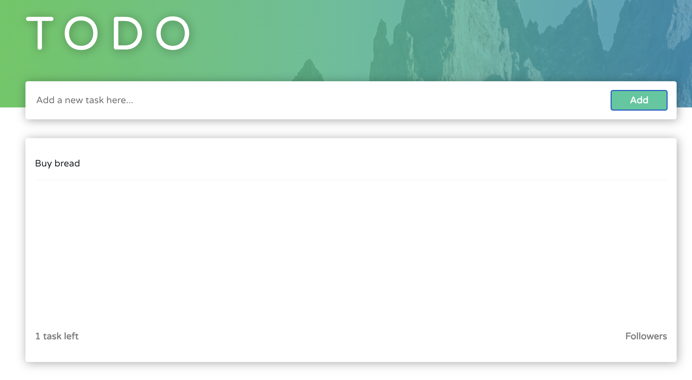
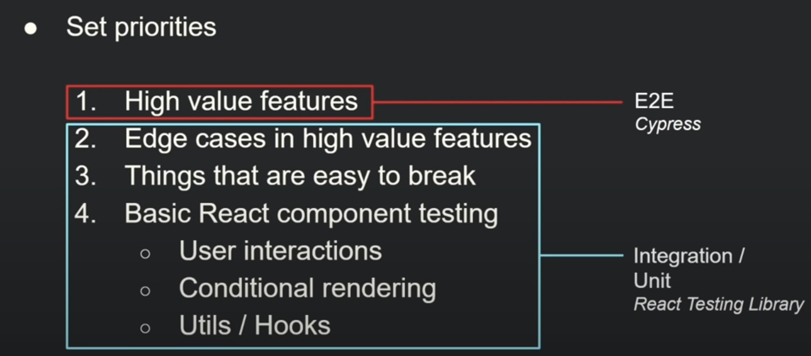
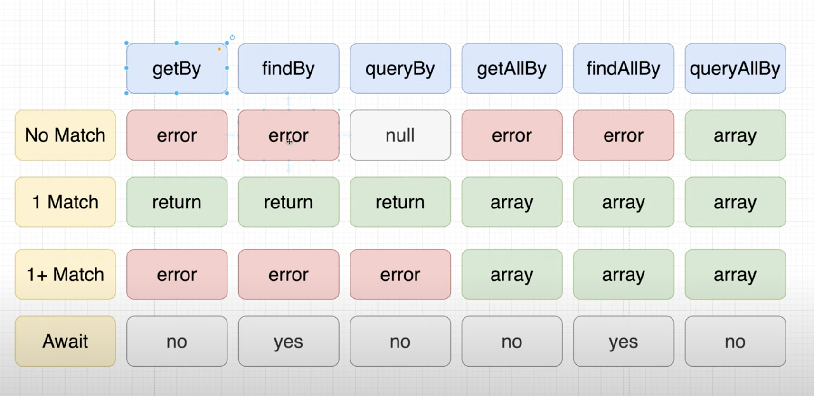
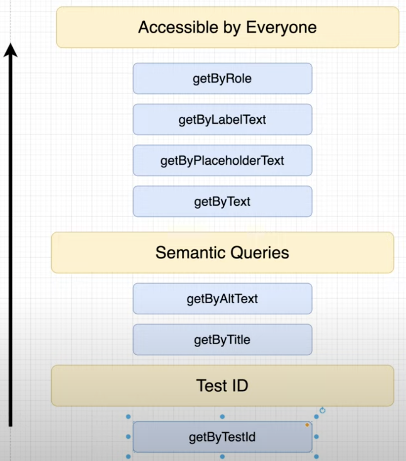

# Unit and integration tests with React Testing Library

Project from following https://www.youtube.com/watch?v=7dTTFW7yACQ&list=PL4cUxeGkcC9gm4_-5UsNmLqMosM-dzuvQ and https://www.youtube.com/watch?v=bvdHVxqjv80

How to use this repo: read through the README and look through the examples. There are some unit tests but mostly integraion tests. We test React components, custom hooks, components using global state (Redux or Zustand), and we mock api calls using Jest for Axios, as well as MSW for mocking api routes independent of if using fetch() or axios(). We also look at end-to-end testing with Cypress.

## Why testing?

In big applications, it's good to write tests for each feature, then when working on a single feature you can just write tests for that and then have the automated tests run to check that all the other features still work to ensure the new feature isn't breaking existing features. Manual tests are still very important, but in big applications this can take a very long time, so having automated tests speeds things up while working on new features.

Benefits of automated testing:

- Catch bugs
- Increase confidence in application
- Speeds up QA time (less time manual testing)
- Can serve as documentation

## Arrage, Act, Assert -- Testing Philosophy

The idea is: First you put the application into a specific state, then you take some action in the application that causes it to change, and finally you check the resulting application state.

## Unit tests

Look at the "tasks left" components -- it is passed a prop from its parent for how many todos there are. We can perform a unit test on just that component to see that the prop it is passed causes the text "n tasks left" to render on screen.

We'd just be testing that component in isolation from all the other components -- therefore it's a unit test.



## Integration tests

Tests components that are interacting with eachother and if they are working correctly; e.g. if type a todo, click "Add" => is a todo component added to the list with correct text, and is the "n tasks left" updated correctly.

## End-to-end tests

Tests what the user would do in the app from beginning to end; e.g.:

1. user logs in
2. user completes a questionaire
3. user adds a todo

End to end tests very important as they simulate the user flow and they really test all the features in the app.

Not usually done with React Testing Library; usually with Puppeteer or Cyprus.

## Testing priority

A sensible testing strategy. Prioritise high-value features:



## Creating tests

All files that end in .test.js will run as tests with React Testing Lib with `yarn test`.

Example: below shows a typical test block. NOTE: can also use `it` instead of `test` -- they are same thing.

```js
import { render, screen } from "@testing-library/react";
import App from "./App";

// Test block
test("renders learn react link", () => {
  // 1. Render a component we want to test
  render(<App />);
  // 2. Find elements we want to interact with. Screen allows us to get things from the DOM via its Query Methods.
  const linkElement = screen.getByText(/learn react/i);
  // 3. Interact with those elements -- e.g. input text, click a btn
  // 4. Assert that the results are as expected. It's good practice to have one assert per test, as it makes it easier to see where the error is occuring..
  expect(linkElement).toBeInTheDocument();
});
```

## `screen` methods



Use `findBy()` if need to await some async call, like fetching data from api before rendering components.

Can use `queryBy()` if want to check that an elemenet doesn't exist on the screen -- this returns null, which you can then assert to cause the test to pass. If we used `getBy()` then it would cause the test to fail as no element found.

### Which `screen` methods should you prioritise?

Tests are best when they mimic how a user will use your app. E.g. users will look for a button element to submit a form, so using `getByRole` would be good here. Screen readers use the Semantic Queries. But users will never `getByTestId`, so use that as a last resort.



## Mocking Requests

If you have tests that have components or functions that are making API calls, there could be issues:

- Requests cost money: you will have to pay the api service more money, or the api service will incur higher costs
- Requests are slow: if you have 1000s of tests that make api calls -- it could take days for the tests to complete!!
- Our tests are dependent on something external (often most important reason): we just want to test out our frontend app, not external services. If we are making http reqs and waiting for data to come back, we are testing the api as well. If api fails, our test fails -- making our tests very flaky and they wont increase the confidence in our app.

SOLUTION: test the React app in complete isolation, and test the API in complete isolation. Any interaction between frontend and api can be mocked.

### How to mock API requests

To mock an npm package, like `axios`, for create-react-app we can create a file `src/__mocks__/axios.js` and jest will automatically look for files in `__mocks__`. E.g. to create a global mock for all axios calls:

```js
const mockAxios = jest.genMockFromModule("axios");

// Mock the `get` method (you can also mock post, put, etc.)
mockAxios.get.mockResolvedValue({ data: {} });

export default mockAxios;
```

Then, when we import axios in our test files, it will use this mocked version of axios, and we can mock the resolved value per test -- see `FollowersList.test.js`.

## Configuring Jest

Can configure in package.json, e.g.:

```json
"jest": {
  "resetMocks": false
}
```

Although, the industry standard for mocking API requests INDEPENDENT of the way we make ajax reqs (fetch vs axios) is to use MSW (see below).

## Testing state hooks

### useState()

E.g. if we have a simple counter component that increments the count state on every button click, we can simply:

- Render the `<Counter>` component
- Get the button element
- Get the div element that displays the count
- Fire a click event
- Assert that the div displays "Count is 1".

### useEffect with Mock Service Worker (MSW)

If we have a component that uses a useEffect to fetch some data, we can use MSW package to mock all api calls, regardless of whether we are using `fetch`, `axios` or whatever -- we can just mock the api request:

First, set up MSW:

- yarn add msw -D
- create a "mocks" folder in src or root (depends on the project)
- for test runners that use node, like jest, we create "mocks/node.js" file with:

```js
// src/mocks/node.js
import { setupServer } from "msw/node";
import { handlers } from "./handlers";

export const server = setupServer(...handlers);
```

Then, create our handlers for any api routes our React app is calling:

```js
// src/mocks/handlers.js
import { http, HttpResponse } from "msw";

export const handlers = [
  // Intercept "GET https://example.com/user" requests...
  http.get("https://example.com/user", () => {
    // ...and respond to them using this JSON response.
    return HttpResponse.json({
      id: "c7b3d8e0-5e0b-4b0f-8b3a-3b9f4b3d3b3d",
      firstName: "John",
      lastName: "Maverick",
    });
  }),

  http.post("/post/:postId", async ({ request, params, cookies }) => {
    const { postId } = params;
    const requestBody = await request.json();
  }),

  // etc...
];
```

(Note: we can also [Mock GraphQL requests](https://mswjs.io/docs/network-behavior/graphql))

In the `setupTests.js` file:

```js
import { server } from "./mocks/node";

// Start the server before all tests.
beforeAll(() => server.listen());
// Reset any handlers that are used during the tests.
afterEach(() => server.resetHandlers());
// Stop the server after all tests are done.
afterAll(() => server.close());
```

Now, in our tests, whenever we render a component that makes a request to any of the routes defined in `handlers.js`, it will return the mock data. Easy.

How to structure larger projects: https://mswjs.io/docs/best-practices/structuring-handlers:

File structure:

```
mocks/
  handlers/
    user.js
    checkout.js
    index.js
```

```js
// mocks/handlers/user.js
import { http } from "msw";

// These request handlers focus on the endpoints
// that concern the user.
export const handlers = [
  http.get("/user", getUserResolver),
  http.post("/login", loginResolver),
  http.delete("/user/:userId", deleteUserResolver),
];
```

```js
// mocks/handlers/index.js
import { handlers as userHandlers } from "./user";
import { handlers as checkoutHandlers } from "./checkout";

// The root-level request handlers combine
// all the domain-based handlers into a single
// network description array.
export const handlers = [...userHandlers, ...checkoutHandlers];
```

So, to test a useEffect api call -- we can render the component, get the element that displays the data, and check the text content displays the data. Simple.

#### Dealing with happy and sad server responses

Example:

```js
// mocks/handlers.js
import { http, HttpResponse } from "msw";

export const handlers = [
  http.get("/user", () => {
    return HttpResponse.json({ name: "John Maverick" });
  }),
];
```

```js
import { http } from "msw";
import { server } from "../mocks/node";

afterEach(() => {
  server.resetHandlers();
});

// This test takes advantage of the happy path behavior
// listed in the "handlers.js", which means that requests
// to the "GET /user" endpoint always return a mocked response.
it("displays the user info", () => {
  render(<UserComponent />);
  expect(screen.getByText("John Maverick")).toBeVisible();
});

it("handles errors when fetching the user", () => {
  // This test, however, needs a reliable way to reproduce
  // a server error to test the UI. Instead of adding this
  // behavior in the "handlers.js", add a runtime override
  // so that requests to "GET /user" always return an error.
  server.use(
    http.get("/user", () => {
      return new HttpResponse(null, { status: 500 });
    })
  );

  render(<UserComponent />);
  expect(screen.getByRole("alert")).toHaveText("Error!");
});
```

For example of how to setup msw on a quick ugly per-file basis, see /customHooks/useApi.test.js

## Testing custom hooks

PROBLEM: "Invariant Violation: Hooks can only be called inside the body of a function component."

SOLUTION: Install `yarn add --dev @testing-library/react-hooks`

See /customHooks examples.

## Testing Redux

1. Configure Redux using RTK: https://redux-toolkit.js.org/tutorials/quick-start
2. Create /src/app/store.js
3. Wrap index.js in Redux provider
4. Create actions and reducer functions using the handy createSlice() func from RTK, see counterSlice.js
5. Create a component that reads and/or dispatches to the store, see ReduxCounter.js
6. Test, see ReduxCounter.test.js

## Testing Zustand -- the lightweight Redux alternative

1. Create store: see /src/app/zustandStore.js
2. Create component using that store: ZustandCounter.js
3. Create tests: ZustandCounter.test.js

## End-to-end testing with Cypress

1. Intall: `yarn add -D cypress @testing-library/cypress`
2. Run Cypress: `yarn run cypress open`. This opens up the Cypress desktop software.
3. In Cypress, select "End to end testing". This will create the Cypress configuration files in your project.
4. In /cypress/support/commands.js, add `import "@testing-library/cypress/add-commands";`. This isn't necessary, but you can now use some of DOM Testing Library's `findBy`, and `findAllBy` commands off the global `cy` object (making things more consistent with our unit and integration tests using React Testing Library).
5. In Cypress, select browser (probs Chrome!)
6. Cypress opens up Chrome. Click create new spec with the default name. This is a template for you to start writing your end to end tests.

## Example end to end test

Create file `/cypress/e2e/payment_spec.cy.js`. Below is an end to end test for a user logging in to a payments app, checking their account $, making a payment to another user, then checking the amount was deducted from their balance -- a very typical way that a user would likely interact with such an app:

```js
const { v4: uuidv4 } = require("uuid");

describe("payment", () => {
  it("user can make payment", () => {
    //  login
    cy.visit("/");
    cy.findByRole("textbox", { name: /username/i }).type("johndoe");
    cy.findByLabelText(/password/i).type("s3cret");
    cy.findByRole("checkbox", { name: /remember me/i }).check();
    cy.findByRole("button", { name: /sign in/i }).click();

    // check account balance
    let oldBalance;
    cy.get("[data-test=sidenav-user-balance]").then(
      ($balance) => (oldBalance = $balance.text())
    );

    // click on new button
    cy.findByRole("button", { name: /new/i }).click();

    // search for user
    cy.findByRole("textbox").type("devon becker");
    cy.findByText(/devon becker/i).click();

    // add amount and note and click pay
    const paymentAmount = "5.00";
    cy.findByPlaceholderText(/amount/i).type(paymentAmount);
    const note = uuidv4();
    cy.findByPlaceholderText(/add a note/i).type(note);
    cy.findByRole("button", { name: /pay/i }).click();

    // return to transactions
    cy.findByRole("button", { name: /return to transactions/i }).click();

    // go to personal payments
    cy.findByRole("tab", { name: /mine/i }).click();

    // click on payment
    cy.findByText(note).click({ force: true }); // Cypress failed this test cus the header was obscuring the text -- we could try to scroll this into view, but lets just force it cus we know in the real app on fullscreen that this text is not anywhere near obscured.

    // verify if payment was made
    cy.findByText(`-$${paymentAmount}`).should("be.visible");
    cy.findByText(note).should("be.visible");

    // verify if payment amount was deducted
    cy.get("[data-test=sidenav-user-balance]").then(($balance) => {
      const convertedOldBalance = parseFloat(oldBalance.replace(/\$|,/g, ""));
      const convertedNewBalance = parseFloat(
        $balance.text().replace(/\$|,/g, "")
      );
      expect(convertedOldBalance - convertedNewBalance).to.equal(
        parseFloat(paymentAmount)
      );
    });
  });
});
```

# Getting Started with Create React App

This project was bootstrapped with [Create React App](https://github.com/facebook/create-react-app).

## Available Scripts

In the project directory, you can run:

### `yarn start`

Runs the app in the development mode.\
Open [http://localhost:3000](http://localhost:3000) to view it in the browser.

The page will reload if you make edits.\
You will also see any lint errors in the console.

### `yarn test`

Launches the test runner in the interactive watch mode.\
See the section about [running tests](https://facebook.github.io/create-react-app/docs/running-tests) for more information.

### `yarn build`

Builds the app for production to the `build` folder.\
It correctly bundles React in production mode and optimizes the build for the best performance.

The build is minified and the filenames include the hashes.\
Your app is ready to be deployed!

See the section about [deployment](https://facebook.github.io/create-react-app/docs/deployment) for more information.

### `yarn eject`

**Note: this is a one-way operation. Once you `eject`, you can’t go back!**

If you aren’t satisfied with the build tool and configuration choices, you can `eject` at any time. This command will remove the single build dependency from your project.

Instead, it will copy all the configuration files and the transitive dependencies (webpack, Babel, ESLint, etc) right into your project so you have full control over them. All of the commands except `eject` will still work, but they will point to the copied scripts so you can tweak them. At this point you’re on your own.

You don’t have to ever use `eject`. The curated feature set is suitable for small and middle deployments, and you shouldn’t feel obligated to use this feature. However we understand that this tool wouldn’t be useful if you couldn’t customize it when you are ready for it.

## Learn More

You can learn more in the [Create React App documentation](https://facebook.github.io/create-react-app/docs/getting-started).

To learn React, check out the [React documentation](https://reactjs.org/).

### Code Splitting

This section has moved here: [https://facebook.github.io/create-react-app/docs/code-splitting](https://facebook.github.io/create-react-app/docs/code-splitting)

### Analyzing the Bundle Size

This section has moved here: [https://facebook.github.io/create-react-app/docs/analyzing-the-bundle-size](https://facebook.github.io/create-react-app/docs/analyzing-the-bundle-size)

### Making a Progressive Web App

This section has moved here: [https://facebook.github.io/create-react-app/docs/making-a-progressive-web-app](https://facebook.github.io/create-react-app/docs/making-a-progressive-web-app)

### Advanced Configuration

This section has moved here: [https://facebook.github.io/create-react-app/docs/advanced-configuration](https://facebook.github.io/create-react-app/docs/advanced-configuration)

### Deployment

This section has moved here: [https://facebook.github.io/create-react-app/docs/deployment](https://facebook.github.io/create-react-app/docs/deployment)

### `yarn build` fails to minify

This section has moved here: [https://facebook.github.io/create-react-app/docs/troubleshooting#npm-run-build-fails-to-minify](https://facebook.github.io/create-react-app/docs/troubleshooting#npm-run-build-fails-to-minify)
